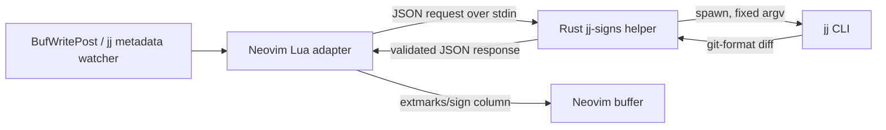

# Plan — Rust-backed Jujutsu gutter signs for Neovim

**Created:** 2026-08-09T09:24:12+03:00  
**Status:** proposed; no implementation started  
**Target:** a standalone Neovim plugin package, not this C3 project

## Goal

Provide Gitsigns-quality, gutter-only change indicators whose source of truth is Jujutsu's current working-copy change. It must work in native `.jj` workspaces and must never use Git's index, `HEAD`, or staging operations.

The initial contract is:

- Attach to file-backed, modifiable Neovim buffers below a `jj root`.
- Compare the working-copy revision (`@`) to its Jujutsu parent baseline using `jj diff -r @ --git`.
- Render added, changed, deleted, and top-deleted line signs and expose hunk navigation and preview.
- Refresh after a buffer write and after externally observed Jujutsu operations.
- Remain read-only: no stage, reset, or Git command is exposed.

`@` vs. its parent(s) is intentional. It reflects the *current jj change*, not all work since a bookmark/trunk. A later `base_revset` option may support review-oriented comparison without changing this default.

## Evidence and constraints

- The installed Jujutsu is `jj 0.43.0-89f62ede8c1c611eaf134c0c49252efd65c7945d`.
- `jj diff -r @ --git --color=never --no-pager -- <fileset>` provides machine-parseable unified Git patches scoped to a file and uses Jujutsu's parent/merge baseline.
- Jujutsu snapshots the working copy when commands run by default. Therefore refreshes must be debounced and triggered only by writes, explicit refreshes, and repository-operation notifications; polling `jj diff` is prohibited.
- `--ignore-working-copy` cannot be used for normal refreshes because it may report a stale snapshot.
- `jj file show` can support a later unsaved-buffer feature, but an `@-` baseline is insufficient for merge working copies. The first release therefore reports only saved worktree state rather than pretending to provide correct live signs.
- This workspace is a C3 project with no Rust or Neovim plugin structure. Keep the implementation in a dedicated repository/package; this plan is only a local handoff artifact.

## Architecture



### Boundary decisions

1. **Lua owns Neovim; Rust owns Jujutsu integration and patch semantics.**
   - Ship a thin Lua plugin for setup, buffer events, `vim.system()`, extmarks, highlights, and mappings.
   - Ship a Rust executable (`jj-signs`) that reads one JSON request from stdin and writes one JSON response to stdout. No Rust shared library, Neovim ABI binding, or permanent RPC daemon in v1.
   - This is portable across Neovim builds, is testable without Neovim, and keeps plugin crashes from taking down the editor.

2. **One helper process per debounced refresh.**
   - Reuse no long-lived daemon initially. A daemon complicates repo invalidation, upgrades, shutdown, and Windows transport while the expensive operation is `jj` itself.
   - Default debounce: 150 ms per repository; coalesce paths and permit only one in-flight refresh per repository. A request that becomes stale is discarded by generation number.

3. **The CLI is the jj API.**
   - Invoke `jj` with `--repository <root>`, `--color=never`, `--no-pager`, and an explicitly constructed argument vector. Never invoke a shell or interpolate paths into command strings.
   - Detect roots by executing `jj root` from the file's directory. Cache positive and negative discoveries by directory; invalidate on directory/buffer changes.
   - Do not reach into `.jj` internal storage. Watch it only as a refresh hint, not as an API.

4. **Use patch records, not a line-status command.**
   - Request one path at a time with `jj diff -r @ --git -- <repo-relative-path>` so the backend obtains the exact baseline Jujutsu selected, including merge behavior.
   - Parse only unified-hunk headers and `+`/`-` line records after the file header. Preserve paths as bytes/UTF-8-aware platform values; reject malformed patches instead of placing guessed signs.

## Protocol and data model

### Request

```json
{
  "protocol_version": 1,
  "repository": "/absolute/path/to/repo",
  "paths": ["src/lib.rs", "README.md"],
  "revision": "@"
}
```

`repository` is an absolute canonical path. `paths` are slash-normalized, repository-relative files after validation that they cannot escape the root. `revision` is fixed to `@` in v1 but included so a later explicit base-revision option is protocol-compatible.

### Response

```json
{
  "protocol_version": 1,
  "repository": "/absolute/path/to/repo",
  "changes": [
    {
      "path": "src/lib.rs",
      "hunks": [
        {
          "old_start": 12,
          "old_count": 2,
          "new_start": 12,
          "new_count": 4,
          "kind": "change",
          "added_lines": [12, 13],
          "changed_lines": [14],
          "deleted_above": 15
        }
      ]
    }
  ],
  "warnings": []
}
```

The Rust helper returns semantic hunks, never Neovim extmark coordinates. The Lua adapter maps 1-based lines to extmarks. For a pure deletion, `deleted_above` is the nearest valid surviving line; use line 1 for deletion at the file head and a dedicated `topdelete` sign when the file is otherwise empty. New/deleted binary files return file-level metadata and no invented per-line signs.

Rust types:

- `Request`, `Response`, `FileChange`, `Hunk`, `ChangeKind`, `Diagnostic` serialized with `serde`.
- `Repository` owns canonical root, `jj` executable path, and a per-request command runner.
- `PatchParser` is a streaming state machine over bytes; it understands Git path quoting and unified hunk headers, and emits structured parse errors.
- `Scheduler` stays in Lua for v1 because it is coupled to Neovim autocmd lifetimes.

Recommended Rust dependencies: `serde`, `serde_json`, `thiserror`, `tempfile` for integration fixtures, and `similar` only for the later unsaved-buffer diff. Avoid a Jujutsu crate dependency: it does not provide a stable supported plugin API and would couple release cadence to jj internals.

## Implementation slices

### 1. Bootstrap and protocol contract

- Create a Cargo workspace with `crates/jj-signs-core` and `crates/jj-signs-cli`; create `lua/jj-signs/` as the Neovim runtime package.
- Define JSON protocol structs, strict version validation, and stable error codes (`not_a_repository`, `jj_not_found`, `jj_failed`, `invalid_path`, `invalid_patch`, `cancelled`).
- Add `jj-signs --version` and `jj-signs --request -` interfaces. Stdout is JSON only; diagnostics go to stderr.
- Add an end-to-end fixture that creates a temporary native `jj git init` repository, changes files, calls the helper, and validates the response.

**Acceptance:** malformed JSON, unknown protocol versions, traversal paths, unavailable `jj`, and a non-repository directory fail predictably without a panic or shell execution.

### 2. Correct Jujutsu diff extraction

- Resolve and canonicalize `jj root`; derive every requested path relative to it.
- Invoke `jj --repository <root> diff -r @ --git --color=never --no-pager -- <path>` with an argument array.
- Classify normal modification, addition, deletion, rename/copy, binary content, and conflict output. A file may appear in more than one file section; merge them only after validating paths.
- Map patch hunks to sign semantics. Adjacent add/delete runs form a `change` hunk; unmatched additions form `add`; unmatched deletions create one `delete` anchor.
- Return a precise diagnostic for an unparsable diff; preserve current signs in Lua until a valid replacement arrives.

**Acceptance:** golden tests cover empty files, first/last-line edits, pure deletions, full-file replacement, no-final-newline markers, spaces/tabs, Unicode path names, renamed files, binary files, conflicted files, and a merge working-copy revision.

### 3. Neovim adapter and rendering

- Implement `require("jj-signs").setup(opts)` with defaults for signs, debounce, `jj_command`, and `base_revision = "@"`.
- On `BufReadPost`, `BufWritePost`, `BufFilePost`, and `DirChanged`, discover/attach or detach. Ignore terminal, special, unlisted, non-file, and out-of-root buffers.
- Maintain `{repo, path, generation, extmark_ids, last_result}` per buffer plus one per-repo queued request.
- Use a dedicated namespace and `sign_text` extmarks. Never mutate buffer text, diagnostics, GitSigns namespaces, or user sign definitions.
- Clear/reapply signs atomically only when the matching generation succeeds. Clear on detach, file rename, and buffer wipe.
- Provide commands: `:JjSignsRefresh`, `:JjSignsToggle`, and `:JjSignsPreviewHunk`; maps are opt-in. Hunk navigation uses the structured hunk list, not sign-column scans.

**Acceptance:** opening, writing, renaming, and closing buffers produces no leaked extmarks; existing Gitsigns extmarks and mappings remain present; refresh of 20 changed buffers produces at most one concurrent jj command per repository.

### 4. Repository-change refresh

- Watch the repository's `.jj` directory recursively with Neovim `uv.fs_event`, debounced separately from writes. Treat any event as a refresh hint only.
- Suppress self-induced watcher loops by comparing the latest returned operation/change identity to the last accepted result and by retaining at most one queued refresh.
- On `FocusGained` and `BufEnter`, refresh attached buffers whose repo generation changed while the editor was inactive.
- If the watcher cannot start (network filesystem, permissions, platform limitation), retain write-triggered and explicit refresh behavior and show one non-blocking warning.

**Acceptance:** `jj new`, `jj edit`, `jj squash`, `jj undo`, external file changes, and focus return update visible signs without Neovim restart; a file watcher storm does not create an unbounded command loop.

### 5. UX, compatibility, and optional live updates

- Document coexistence with Gitsigns: both can render signs; users should disable Gitsigns only for jj repositories if duplicate columns are undesirable. No automatic disabling of another plugin.
- Ship `disable_in_colocated_git_repos` as an explicit opt-in predicate for users who want Jujutsu signs to replace Gitsigns there. Native jj workspaces attach normally.
- Never provide Git-stage/reset commands. The only future mutations should call explicit `jj` commands and must be designed separately.
- After v1 saved-state correctness is proven, add opt-in unsaved-buffer signs. Obtain the exact saved `@` content and apply an in-memory line diff against Neovim buffer text. Do not ship this for merge changes until the baseline is proven equivalent to `jj diff -r @`.

**Acceptance:** documentation clearly distinguishes saved state from opt-in unsaved state; duplicate rendering is a user configuration choice, never a hidden plugin conflict.

## Verification matrix

| Layer | Verification |
| --- | --- |
| Rust parsing | Unit/golden tests for each diff fixture and malformed input. |
| CLI/Jujutsu | Temporary native jj repositories exercising add/change/delete/rename/conflict/merge; assert JSON protocol output. |
| Lua unit | Mock `vim.system` and extmarks; assert scheduling, generation discard, detach, and path handling. |
| Neovim smoke | Headless Neovim opens fixture buffers, writes content, runs helper, then queries extmarks/signs. |
| Compatibility | Headless fixture with Gitsigns loaded verifies separate namespaces and intact Gitsigns signs. |
| Manual smoke | Native jj workspace and a colocated Git workspace; run `jj new`, `jj edit`, `jj squash`, `jj undo`, then observe updates in an interactive Neovim session. |

Performance gate: a 10,000-line changed file must render in under 150 ms after helper output on a developer workstation; repositories with 100 attached buffers must not run more than one helper process concurrently per repository. Measure and report command time and render time separately before optimizing.

## Non-goals for v1

- Git-index support, staged signs, Git blame, Git hunk staging/resetting, or using `.git` as a fallback.
- Polling, reading Jujutsu internal objects, or a permanent Rust daemon.
- Unsaved-buffer signs, conflict-resolution UI, change creation, or interactive split/squash.
- Reimplementing jj.nvim's log, status, or command UI.

## Risks and mitigation

| Risk | Mitigation |
| --- | --- |
| jj CLI output varies across versions or user templates | Pin `--git`, `--color=never`, `--no-pager`; test supported jj versions; reject invalid patches rather than misrendering. |
| Refresh commands snapshot worktree and create operational churn | Trigger only from debounced writes, explicit refreshes, and repo events; never poll. Document this effect. |
| Native watcher behavior differs on Windows/network volumes | Make the watcher additive, retain write/focus refresh, and test on Windows/macOS/Linux. |
| Gitsigns duplicates visual signs | Separate namespaces and opt-in exclusion; never alter Gitsigns configuration. |
| Merge baselines are subtle | Let `jj diff -r @` remain authoritative; postpone unsaved live diff until equivalence tests cover merges. |

## Checkpoints

1. **Protocol checkpoint:** fixture repository returns stable JSON for add/change/delete. Lock the protocol only after this succeeds.
2. **Correctness checkpoint:** golden/integration matrix passes, including merge and conflict cases. Do not start UI polish before it does.
3. **Editor checkpoint:** headless Neovim tests prove extmark lifecycle and no Gitsigns interference.
4. **Release checkpoint:** manual native and colocated jj smoke tests pass; package docs state saved-state and coexistence semantics.

## Current recommendation

Start with the helper plus a saved-buffer-only Lua adapter. Do not clone Gitsigns' Git-index model or pursue an all-Rust Neovim module: both would either violate jj semantics or create unnecessary ABI/packaging risk. Add live unsaved signs only after the merge-baseline problem has an evidence-backed solution.
