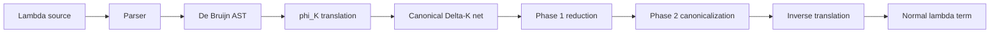

# Guide: implementing full $\Delta K$-Nets in this C3 project

Terminology first: $\lambda K$ is the unrestricted lambda calculus—bound variables may occur zero, one, or many times. $\Delta K$-Nets implement it using:

- **Fan**: application, abstraction, and $\beta$-reduction.
- **Eraser**: unused variables.
- **Replicator**: shared variables and optimal duplication.

Your project currently has a compiling partial interaction kernel in `src/main.c3`; it is not yet a lambda-calculus evaluator. `c3c build` succeeds and the six tests only cover `StableIndexVector`.

## 1. Target end-to-end pipeline



The final executable should support:

```text
parse → resolve names → translate → normalize → read back → print
```

Do not add concurrency initially. A correct sequential leftmost-outermost reducer is the prerequisite for any parallel optimization.

---

## 2. Split the current file into semantic modules

Recommended layout:

```text
src/
  lambda_ast.c3       # AST, parser, printer, De Bruijn conversion
  lambda_reference.c3 # simple normal-order reducer used as an oracle
  net.c3              # nodes, ports, wires, graph mutation API
  translate.c3        # phi_K: lambda term -> canonical Delta-K net
  interact.c3         # core active-pair rules
  canonicalize.c3     # merge, decay, reachability erasure, phase 2
  reduce.c3           # leftmost-outermost scheduler
  readback.c3         # canonical Delta-K net -> lambda term
  main.c3             # CLI only
```

Keep `stable_index_vector.c3`, but stop manipulating its contents directly inside rewrite rules.

---

## 3. Finish the graph model before writing more rules

The existing model lacks information required by translation, scheduling, canonicalization, and readback.

### Required data

```c3
enum PortKind
{
    PRINCIPAL,
    AUXILIARY,
}

enum Polarity
{
    PARENT,
    CHILD,
}

enum ReplicatorStatus
{
    UNPAIRED,
    UNKNOWN,
}

struct ReplicatorAux
{
    StableId port;
    long delta;       // signed
}

struct Replicator
{
    StableId principal;
    ReplicatorAux[] auxiliaries;
    ulong level;      // non-negative
    ReplicatorStatus status;
}
```

Also add non-agent boundary nodes:

```c3
enum BoundaryType
{
    ROOT,
    FREE_VARIABLE,
}
```

A free-variable boundary must retain its source name. The root has one port.

### Central graph API

All rewrites should use a small mutation API:

```text
new_fan()
new_eraser()
new_replicator(level, deltas, status)
new_boundary(type, name)
connect(port_a, port_b)
other(port)
splice(old_port_a, old_port_b)
destroy_agent(node)
```

`destroy_agent` must free a replicator’s auxiliary allocation. Currently:

- `replicator_fan_reduction` does not free the original replicator’s auxiliary slice.
- `Net.free` does not free auxiliary slices owned by surviving replicators.
- The fan–replicator rule creates new auxiliary ports without copying their delta metadata.
- `interact` has no replicator–eraser case.

Centralized constructors and destructors prevent these errors.

### Debug validator

Run this after every rewrite in debug tests:

- Every port belongs to exactly one live node or boundary.
- Every port has exactly one live wire.
- Every wire has two live endpoints.
- `port.wire_id` and the wire endpoints agree.
- Every agent has exactly one principal port.
- Fan has two ordered auxiliaries.
- Eraser has zero auxiliaries.
- Replicator delta count equals auxiliary count.
- Every wire joins one parent and one child.
- Every active pair is a principal–principal wire.
- Replicator levels remain non-negative.
- No allocated auxiliary slice is owned by two nodes.

Do not continue to translation until hand-constructed graphs survive this validator.

---

## 4. Implement lambda syntax and a reference reducer

Use a named AST only for parsing. Resolve it to De Bruijn indices immediately:

```text
Term :=
    BoundVar(index)
  | FreeVar(symbol)
  | Abs(body)
  | App(function, argument)
```

Suggested grammar:

```text
term        := abstraction | application
abstraction := ("λ" | "\") IDENT "." term
application := atom atom*
atom        := IDENT | "(" term ")" | abstraction
```

Application is left-associative; abstraction extends as far right as possible.

Implement a boring capture-free normal-order reducer over De Bruijn terms. It is not the production evaluator: it is your semantic oracle for differential tests.

---

## 5. Implement $\phi_K$: lambda term to canonical net

Use a destination-driven builder. It avoids temporary “variable nodes” for bound variables:

```text
emit(term, parent_port, level, environment)
```

### Variable

```text
Bound variable:
    append (parent_port, level) to its binder’s occurrence list

Free variable:
    create a named free-variable boundary
    connect parent_port to it
```

### Abstraction $[\lambda x.M]_l$

Create a fan with logical ports:

- principal: abstraction result/parent
- auxiliary 0: body
- auxiliary 1: variable

Then:

```text
connect destination to fan.principal
register binder x at abstraction level l
emit M into fan.auxiliary[0] at level l
finish binder:
    0 occurrences:
        connect fan.auxiliary[1] to an eraser

    1 occurrence with delta 0:
        connect fan.auxiliary[1] directly to that occurrence

    otherwise:
        create unpaired replicator:
            level = l + 1
            delta[i] = occurrence_level[i] - (l + 1)
        connect fan.auxiliary[1] to replicator.principal
        connect each replicator auxiliary to its occurrence
```

Deltas must remain signed. For example:

```text
λx.x
```

has abstraction level `0`, replicator level `1`, and occurrence delta `-1`.

### Application $[M\,N]_l$

Create a fan with:

- principal: function
- auxiliary 0: result/parent
- auxiliary 1: argument

```text
connect destination to fan.auxiliary[0]
emit M into fan.principal at level l
emit N into fan.auxiliary[1] at level l + 1
```

Compile the outer term at level `0`, connected to the root boundary.

### First translation fixtures

Verify exact topology for:

```text
λx.x          # one use
λx.y          # eraser
λx.x x        # sharing, deltas [-1, 0]
(λx.x) y      # immediate fan/fan active pair
λx.λy.x       # nested levels
λx.λy.y x     # mixed argument levels
```

---

## 6. Complete the core interaction matrix

| Active pair | Rule |
|---|---|
| Eraser–Eraser | Delete both |
| Eraser–Fan | Delete both; place one eraser on each fan auxiliary |
| Eraser–Replicator | Delete both; place one eraser on each replicator auxiliary |
| Fan–Fan | Annihilate; connect corresponding auxiliary contexts |
| Fan–Replicator | Two replicator copies and one fan per replicator auxiliary |
| Equal Replicator–Replicator | Annihilate; connect corresponding auxiliaries |
| Unequal Replicator–Replicator | Cartesian commutation |

For translated $\lambda$-terms, equal replicator levels imply complete equality. During development, nevertheless validate:

```text
level
arity
ordered delta vector
```

This catches a corrupted translation or rewrite rather than silently misreducing it.

For unequal replicators $A_l(d_0,\ldots,d_n)$ and $B_k(e_0,\ldots,e_m)$ with $l<k$:

- Produce one higher-level replica for every $A$ auxiliary:
  \[
  B_{k+d_i}(e_0,\ldots,e_m)
  \]
- Produce one exact copy of $A_l(d_0,\ldots,d_n)$ for every $B$ auxiliary.
- Connect the two families as an $(n+1)\times(m+1)$ Cartesian grid.
- Preserve auxiliary order.

Use checked signed arithmetic before converting a resulting level back to `ulong`.

---

## 7. Implement canonicalization

Core interactions alone do not produce a canonical $\Delta K$ normal form.

### Unpaired replicator merging

If unpaired replicator $A$ auxiliary $i$, with delta $d$, connects to the principal of unpaired $B$:

- Remove the connecting ports and wire.
- Replace auxiliary $i$ of $A$ with all auxiliaries of $B$.
- Preserve the other $A$ auxiliaries.

The paper states when merging is safe but does not explicitly give the delta-vector rewrite. The compositional rule is:

\[
[d_0,\ldots,d_{i-1},
 d+e_0,\ldots,d+e_m,
 d_{i+1},\ldots,d_n]
\]

**[INFERENCE]** This follows by composing the level offsets.

An unknown consecutive $B$ may be proven unpaired when:

\[
0 \le l_B-l_A \le d
\]

### Unpaired replicator decay

For an unpaired replicator:

1. Remove every auxiliary connected to an eraser.
2. If one auxiliary remains with delta `0`, replace the replicator with a wire.
3. If no auxiliary remains, replace its principal context with an eraser **[INFERENCE]**; document this decision because the paper does not spell out the zero-arity rewrite.

Apply decay before fan replication, replicator replication, and phase-two auxiliary fan replication.

### Reachability erasure

Traverse parent-to-child paths starting at the root:

1. Mark reachable nodes and wires.
2. Delete everything unmarked.
3. Replace connections from retained structure into deleted structure with erasers.
4. Run unpaired decay.

This canonicalization can replace eager eraser interactions, although keeping the local rules is useful for testing the complete core system.

---

## 8. Use the required two-phase reducer

### Phase 1

Sequential leftmost-outermost loop:

```text
repeat:
    find the leftmost-outermost merge or active pair
    decay involved unpaired replicators
    prefer a legal merge before commuting that replicator
    apply exactly one rewrite
until no phase-1 rewrite exists
```

Recompute traversal order from the root initially. Do not depend on stable IDs or insertion order: neither represents lambda-term order.

### Phase 2

The paper defines phase two by treating every fan’s first auxiliary port as its principal port. Parameterize fan interaction rather than cloning the entire reducer:

```text
active_fan_port =
    phase 1: principal
    phase 2: auxiliary 0
```

In phase two, auxiliary fan replication replaces ordinary fan replication. Continue until:

- no fan-out replicators remain;
- sharing structures have accumulated at abstraction variable ports;
- no phase-two rewrite remains.

Then run final reachability erasure and decay.

Only after the sequential evaluator is correct should you experiment with parallel annihilations. $\Delta K$ optimality depends on leftmost-outermost treatment of erasure and unpaired-replicator commutations.

---

## 9. Read the canonical net back to a term

Traverse from the root using polarity:

- Entering a fan through its principal parent port means **abstraction**:
  - read body through auxiliary 0;
  - allocate a fresh binder identity;
  - associate the variable structure on auxiliary 1 with that binder.
- Entering a fan through auxiliary 0 as parent means **application**:
  - read function through principal;
  - read argument through auxiliary 1.
- A named boundary becomes a free variable.
- A wire or canonical replicator branch leading to a binder’s variable port becomes that bound variable.

Return a De Bruijn term first. Assign printable names only afterward. Compare results modulo alpha-equivalence.

---

## 10. Verification ladder

Do not test the entire evaluator first.

### Graph tests

One isolated test for every interaction rule and its mirror ordering. Assert the resulting topology and validator success.

### Translation tests

Golden graphs for the six small terms above. Assert levels, signed deltas, port order, polarity, and unpaired status.

### Semantic differential tests

For each normalizing term:

```text
delta_result =
    readback(normalize(translate(term)))

reference_result =
    normal_order_reduce(term)

assert alpha_equivalent(delta_result, reference_result)
```

Required cases:

```text
(λx.x) y                         -> y
(λx.y) Ω                         -> y
(λx.x x) (λy.y)                 -> λy.y
(λx.λy.x) a b                   -> a
(λx.λy.y) a b                   -> b
(λf.λx.f (f x)) g z             -> g (g z)
```

Add Church booleans, numerals, nested sharing, free variables, shadowing, and the paper’s Lamping examples.

For $\Omega=(\lambda x.x\,x)(\lambda x.x\,x)$, use a step limit. Assert that each step preserves graph invariants; once canonicalization is complete, track live-node growth as a performance regression check.

### Definition of done

The implementation is full only when this succeeds:

```text
source
  → parse
  → De Bruijn
  → canonical Delta-K net
  → phase 1
  → phase 2
  → erasure/decay
  → readback
  → alpha-equivalent normal form
```

## Recommended immediate order

1. Replace direct graph mutations with constructors, `connect`, `splice`, and destructors.
2. Add polarity, boundaries, replicator status, and the graph validator.
3. Repair and test all six core interaction families.
4. Add parser and reference reducer.
5. Implement translation.
6. Implement leftmost-outermost phase one.
7. Add merge, decay, and reachability erasure.
8. Add phase two.
9. Add readback and differential tests.
10. Optimize allocation and parallelism last.

## Primary references

- [$\Delta$-Nets paper, arXiv:2505.20314](https://arxiv.org/abs/2505.20314)
- [Official interactive evaluator](https://deltanets.org/)
- [Official project repository](https://github.com/danaugrs/deltanets)
- [Independent Go implementation—use as secondary evidence, not the specification](https://github.com/denful/GoDNet)
