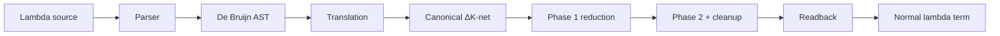

# Guide: finishing ΔK-nets in this C3 project

This is the short path through the work. For the full explanation of *why*
each piece exists—polarity, sharing levels, the two reduction phases, and the
rest—see `DELTA_K_IMPLEMENTATION_GUIDE.md`.

---

## What you are building

**λK** is ordinary lambda calculus: a bound variable may be used never, once,
or many times. A **ΔK-net** evaluates that calculus as a graph of agents and
wires instead of as a recursive tree walk.

Three agents cover the whole job:

| Agent | Job |
|---|---|
| **Fan** | Application, abstraction, and β-reduction when two fans meet head-on |
| **Eraser** | “This is unused” — delete work that cannot affect the answer |
| **Replicator** | “This is shared” — duplicate only when forced, with level bookkeeping |

Your tree already has a partial interaction kernel in `src/main.c3`. It is not
yet a lambda evaluator. Local pair rules are tested; parser, translation,
scheduler, canonicalization, and readback are not.

---

## End-to-end pipeline



The executable should eventually do:

```text
parse → resolve names → translate → normalize → read back → print
```

Stay sequential at first. A correct leftmost-outermost reducer is the
prerequisite for every later parallel experiment.

---

## Suggested modules

```text
src/
  lambda_ast.c3        # AST, parser, printer, De Bruijn conversion
  lambda_reference.c3  # simple normal-order oracle
  net.c3               # nodes, ports, wires, mutation API
  translate.c3         # lambda term → canonical net
  interact.c3          # core active-pair rules
  canonicalize.c3      # merge, decay, reachability cleanup
  reduce.c3            # leftmost-outermost scheduler
  readback.c3          # net → lambda term
  main.c3              # CLI only
```


---

## Finish the graph model first

Isolated rewrites are not enough. A complete evaluator must answer:

1. Which way does computation flow through this port?
2. Is this fan being read as an abstraction or as an application?
3. Is this replicator a fan-in or a fan-out, and may it merge?
4. What part of the graph is still reachable from the result?

Those are not cosmetic annotations. They decide translation, scheduling,
cleanup, and readback.

### Polarity

The same `Fan` type means two different pieces of syntax:

```text
abstraction:  two parent ports, one child port
application:  one parent port, two child ports
```

The difference is the direction from which you meet the fan when walking from
the root. Give every port a polarity:

```text
PARENT — the surrounding term points into this port
CHILD  — this fragment points toward a subterm
```

Invariant:

```text
every wire joins exactly one parent to exactly one child
```

Without that:

- readback cannot tell `λx.M` from `M N`
- leftmost-outermost order has no graph definition
- replicator orientation is guesswork
- garbage collection cannot walk “from the answer outward”

Store polarity on `Port`. Reject parent–parent and child–child wires in
`validate_net`.

### Core data

```c3
enum PortKind    { PRINCIPAL, AUXILIARY }
enum Polarity    { PARENT, CHILD }
enum ReplicatorStatus { UNPAIRED, UNKNOWN }

struct ReplicatorAux
{
    StableId port;
    long delta;        // signed
}

struct Replicator
{
    StableId principal;
    ReplicatorAux[] auxiliaries;
    ulong level;       // non-negative
    ReplicatorStatus status;
}
```

Auxiliary order is meaning, not packing. Delta `i` belongs to auxiliary `i`.

### Interfaces at the edge of the net

```c3
enum InterfaceKind { ROOT, FREE_VARIABLE }

struct Interface
{
    InterfaceKind kind;
    String name;       // free-variable name; empty for root
    StableId port;
}
```

- The **root** is where the answer lives. Translation attaches the term there;
  readback and reachability start there.
- A **free-variable interface** keeps an open name observable. Anonymous dangling
  ports are fine for one local rewrite test and useless for a real evaluator.

### Mutation API

```text
new_fan()
new_eraser()
new_replicator(level, deltas, status)
new_interface(kind, name)
connect(port_a, port_b)
other(port)
splice(old_port_a, old_port_b)
destroy_agent(node)
```

Constructors and destructors should enforce:

- replicator auxiliary count equals metadata count
- copied auxiliaries keep position and signed delta
- a copied auxiliary is assigned the polarity opposite its output replicator
  principal; fan–replicator commutation creates one fan-in and one fan-out
- new ports receive polarity before wiring
- deleted ports disconnect before erasure
- auxiliary slices are copied or transferred, never accidentally shared

### Validator checklist

Run after every rewrite in debug tests:

- every port belongs to exactly one live node or interface
- every port has exactly one live wire; every wire has two live ends
- `port.wire_id` agrees with the wire endpoints
- every agent has one principal; fans have two ordered auxiliaries
- erasers have no auxiliaries; replicator deltas match auxiliaries
- every wire is parent–child; every active pair is principal–principal
- replicator levels stay non-negative
- no auxiliary slice has two owners
- every port has polarity
- canonical replicators are fan-ins; fan-outs are visible from polarity
- interfaces have correct polarity and identity (one root; named frees)

Do not start translation until hand-built graphs survive this.

---

## Lambda syntax and a reference reducer

The net is hard to debug: a wrong wire can look plausible for several steps.
First build a small ordinary evaluator that answers *what should this term
become?* with no graphs involved.

### Parse, then index

```text
Term :=
    BoundVar(index)
  | FreeVar(symbol)
  | Abs(body)
  | App(function, argument)
```

```text
term        := abstraction | application
abstraction := ("λ" | "\") IDENT "." term
application := atom atom*
atom        := IDENT | "(" term ")" | abstraction
```

Application is left-associative; abstraction extends right. `f x y` is
`(f x) y`; `λx.x y` is `λx.(x y)`.

De Bruijn indices count binders between an occurrence and its binder. In
`λx.λy.x`, `x` is `BoundVar(1)` and `y` is `BoundVar(0)`. Free names stay symbols.

### Normal-order oracle

Reduce leftmost-outermost. Substitute only when the function is an abstraction.
That way `(λx.y) Ω` becomes `y` without entering `Ω`.

Need:

- `shift(d, cutoff, term)`
- `subst(j, replacement, term)`
- `normalize(term, limit)`

`shift` prevents capture when terms move under binders. Use a step limit for
`Ω`. Keep this reducer free of graph types so it stays an honest oracle.

Later, for each fixture:

1. parse to De Bruijn
2. normalize with the oracle
3. translate the same term to a net
4. reduce the net and read it back
5. compare modulo alpha-equivalence

---

## Translation: term → canonical net

Destination-driven builder:

```text
emit(term, parent_port, level, environment)
```

### Variable

```text
bound:  append (parent_port, level) to the binder’s occurrence list
free:   connect parent_port to the named free-variable interface
```

### Abstraction `[λx.M]` at level `l`

Fan ports:

- principal: result / parent
- auxiliary 0: body / child
- auxiliary 1: variable / parent

```text
connect destination to fan.principal
emit M into body at level l
finish variable port:
    0 uses              → eraser
    1 use, delta 0      → direct wire
    otherwise           → unpaired replicator
                            level = l + 1
                            delta[i] = occurrence_level[i] - (l + 1)
```

Deltas stay signed. Identity `λx.x` is the classic level/`-1` example.

### Application `[M N]` at level `l`

Fan ports:

- principal: function / child
- auxiliary 0: result / parent
- auxiliary 1: argument / child

```text
connect destination to result auxiliary
emit M into principal at level l
emit N into argument auxiliary at level l + 1
```

Outermost term: level `0`, wired to the root.

### First fixtures

```text
λx.x
λx.y
λx.x x
(λx.x) y
λx.λy.x
λx.λy.y x
```

---

## Core interaction matrix

| Active pair | Rule |
|---|---|
| Eraser–Eraser | Delete both |
| Eraser–Fan | Delete both; eraser on each fan auxiliary |
| Eraser–Replicator | Delete both; eraser on each replicator auxiliary |
| Fan–Fan | Annihilate; splice abstraction body to application result and abstraction variable to application argument |
| Fan–Replicator | Produce one fan-in and one fan-out replicator; one new fan per old replicator auxiliary |
| Equal Replicator–Replicator | Annihilate; connect matching auxiliaries |
| Unequal Replicator–Replicator | Cartesian commutation |

During development, still validate level, arity, and ordered deltas on
“equal” pairs. That catches corruption even when the fast path only compares
levels.

For unequal `A_l(d…)` and `B_k(e…)` with `l < k`:

- one higher-level `B` copy per `A` auxiliary, at level `k + d_i`
- one exact `A` copy per `B` auxiliary
- wire as a Cartesian grid; preserve order
- checked signed arithmetic before storing levels as `ulong`

---

## Canonicalization

Interactions fire on principal–principal wires. Canonicalization cleans sharing
structure that is not necessarily an active pair.

### Unpaired merge

If unpaired `A`’s auxiliary `i` with delta `d` meets unpaired `B`’s principal,
and `0 ≤ level(B) - level(A) ≤ d`, merge:

```text
new deltas =
  A’s deltas before i,
  then each of B’s deltas plus d,
  then A’s deltas after i
```

Consider merge before commuting that same unpaired replicator.

### Decay

For an unpaired replicator:

1. drop auxiliaries wired to erasers
2. one remaining auxiliary with delta `0` → replace by a wire
3. zero auxiliaries → replace principal context by an eraser (document the choice)

Decay before any rewrite that would copy the replicator.

### Reachability cleanup

From the root, parent-to-child:

1. mark reachable structure
2. delete the rest
3. insert erasers where retained structure still touched deleted structure
4. run decay again

---

## Two-phase reducer

### Why order matters

Scanning `net.wires` in storage order is not lambda order.

- `(λx.y) Ω` must erase `Ω`, not diverge inside it
- an unpaired merge must beat a commutation that would copy the same structure

### Phase 1

```text
repeat:
    traverse root → children by polarity
    pick leftmost-outermost legal merge or active pair
    decay before copying a replicator
    prefer legal merge before commute
    apply one rewrite
until stuck
```

Recompute traversal after every step.

### Phase 2

Treat each fan’s first auxiliary as the active fan port. Continue until fan-out
replicators are gone and sharing has settled on variable ports. Then final
reachability cleanup and decay.

Parallelize independent rewrites only after the sequential path is correct.

---

## Readback

From the root, by polarity:

- fan entered by principal parent → abstraction
- fan entered by result-auxiliary parent → application
- named free-variable interface → free name
- path into a binder’s variable structure → bound variable

Read De Bruijn first; pretty-print names afterward. Compare modulo
alpha-equivalence.

---

## Verification ladder

1. **Graph tests** — every interaction, both endpoint orders, validator green
2. **Translation tests** — golden graphs for the six small terms
3. **Semantic tests**

```text
assert alpha_equivalent(
    readback(normalize(translate(term))),
    normal_order_reduce(term)
)
```

Minimum suite:

```text
(λx.x) y              → y
(λx.y) Ω              → y
(λx.x x) (λy.y)      → λy.y
(λx.λy.x) a b        → a
(λx.λy.y) a b        → b
(λf.λx.f (f x)) g z  → g (g z)
```

### Done means

```text
source → parse → De Bruijn → net → phase 1 → phase 2
      → cleanup → readback → alpha-equivalent normal form
```

### Immediate order

1. constructors / `connect` / `splice` / destructors  
2. polarity, interfaces, validator  
3. core interaction families  
4. parser + reference reducer  
5. translation  
6. phase-one scheduler  
7. merge, decay, reachability  
8. phase two  
9. readback + differential tests  
10. allocation and parallelism last  

---

## References

- [Δ-Nets paper](https://arxiv.org/abs/2505.20314)
- [Official evaluator](https://deltanets.org/)
- [Official repo](https://github.com/danaugrs/deltanets)
- [Go port — secondary evidence only](https://github.com/denful/GoDNet)
- Full write-up: `DELTA_K_IMPLEMENTATION_GUIDE.md`
