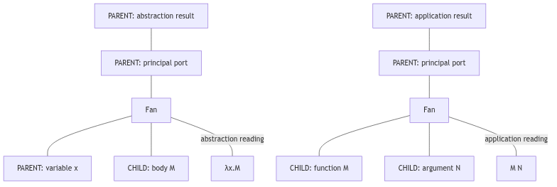
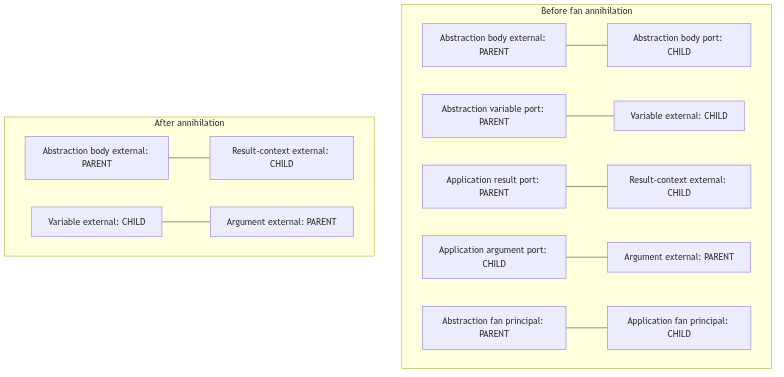
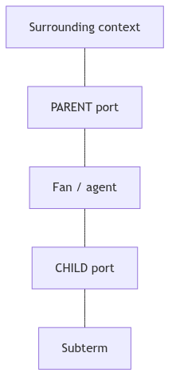
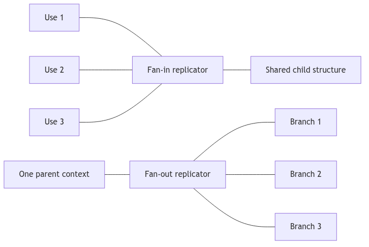

# Building a ΔK-Net Evaluator

*A practical guide for this C3 repository*

---

If you have ever written a recursive tree-walk interpreter for the lambda
calculus, you already know the shape of the problem: parse a term, reduce
applications, and print whatever is left. That approach works. It is also
slow once sharing enters the picture, because every copy of a subterm tends
to become a real copy.

Δ-Nets take a different route. Instead of walking an abstract syntax tree,
they turn the term into a small graph of agents and wires, then let local
rewrites do the work of β-reduction, erasure, and controlled duplication.
The full system for ordinary lambda calculus—where a bound variable may be
used zero, one, or many times—is called a **ΔK-net**.

This guide is written for the project in front of you: a C3 codebase with a
partial interaction kernel in `src/main.c3`. It is not a tutorial on every
flavor of interaction net. The goal is simpler and stricter:

1. finish a correct sequential ΔK evaluator, then
2. only afterward experiment with parallelism and clever allocation.

The style of explanation follows the spirit of a good interpreter book:
start from what you already know, name the new idea carefully, show why it
exists, and only then talk about structs and loops.

Primary paper: [Δ-Nets: Interaction-Based System for Optimal Parallel λ-Reduction](https://arxiv.org/abs/2505.20314)
([HTML v4](https://arxiv.org/html/2505.20314v4)).

---

## 1. Where the project stands

### What already works

The repository already has a useful local rewrite engine:

- three agent kinds: **fan**, **eraser**, and **replicator**
- stable IDs for nodes, ports, and wires
- fan–fan annihilation
- eraser interactions
- fan–replicator commutation
- equal and unequal replicator interactions
- basic graph validation
- tests that try both orders of the endpoints on an active wire
- tests for Cartesian wiring and level arithmetic on replicators

Those tests matter. They show that individual rewrite steps can be made
deterministic and checkable.

### What is still missing

Passing twenty-three hand-built graph tests is not the same thing as
evaluating lambda terms. The missing pipeline looks like this:

```text
source text
  → parser
  → De Bruijn term
  → canonical ΔK-net
  → phase-one reduction
  → canonicalization
  → phase-two reduction
  → reachability cleanup
  → readback
  → a lambda term equivalent to the normal form
```

In one sentence:

```text
a local interaction kernel  ≠  a complete ΔK evaluator
```

The kernel is the engine room. The evaluator also needs direction on the
graph, a translation from syntax, a disciplined scheduler, cleanup of
sharing structure, and a way to read the final graph back into a term.

### How to use this status report

Adding another fan–fan fixture improves confidence in one rewrite. It does
not tell you whether the reducer prefers the outer redex, whether an unused
argument is discarded without being reduced, or whether the final graph
still means the same term. Those questions only become answerable once the
end-to-end path exists.

The useful development loop is vertical, not merely wider:

1. keep the local interaction tests
2. add the graph facts those tests currently leave implicit
3. connect the kernel to a tiny parser, translator, reducer, and readback
4. give every layer an observable contract before the next layer depends on it

---

## 2. The idea in plain language

### Lambda calculus, briefly

A lambda term is built from three constructors:

```text
x            a variable
λx.M         an abstraction: a function with parameter x and body M
M N          an application: call M with argument N
```

The central computation step is **β-reduction**:

```text
(λx.M) N  →  M with N substituted for free occurrences of x
```

That one rule is enough to express a surprising amount of computation. It
is also enough to create the usual implementation headaches: variable
capture, unused arguments, and repeated work when a variable is used more
than once.

### What “λK” means

People sometimes study a restricted calculus where every bound variable is
used exactly once. That restriction simplifies graph encodings, because you
never need erasure or duplication. Ordinary programming languages are not
like that. A parameter may be ignored, used once, or used many times.

**λK** is the unrestricted calculus: zero, one, or many uses are all legal.
A ΔK-net is the Δ-net system designed for that full calculus.

### Why a graph instead of a tree

In a tree interpreter, sharing is optional and easy to lose. If the same
subterm is needed twice, you either recompute it or carefully introduce
explicit sharing by hand.

Interaction nets make sharing part of the representation. The program is a
graph. A wire is a connection between two ports. An agent is a node with a
distinguished **principal port** and zero or more **auxiliary ports**. When
two principal ports meet on a wire, that wire is an **active pair**, and a
local rewrite can fire.

For ΔK-nets the three agents line up with three lambda-calculus needs:

| Agent | Everyday role |
|---|---|
| **Fan** | Builds application and abstraction structure. When two fans meet head-on, that meeting is β-reduction. |
| **Eraser** | Marks “this value is unused.” It deletes work that cannot affect the answer. |
| **Replicator** | Marks “this value is shared.” It duplicates only when duplication is forced, and it carries just enough bookkeeping to keep the copies straight. |

The paper splits the system into two layers:

1. **Core interactions** — local principal-to-principal rewrites.
2. **Canonicalization** — ordered cleanups that simplify sharing and remove dead structure without counting as extra β-steps.

That split is not academic tidiness. Local rules are simple. The full
algorithm depends on the order and cleanup surrounding them.

### A tiny example of the two layers

Take `(λx.x) y`.

The application and the abstraction become fans. Their principal ports meet.
That meeting is an ordinary interaction: the fans annihilate, and the pieces
that used to hang off them are spliced together. After that local rewrite,
the graph may still contain an eraser, a temporary wire, or some leftover
sharing agent depending on how the variable was encoded.

Cleaning those leftovers is **canonicalization**. The first rewrite is
computation. The later cleanup is representation management. If you treat
both as the same kind of “just reduce whatever,” the scheduler becomes hard
to specify and easy to get subtly wrong.

---

## 3. Ports, polarity, and why direction matters

This is the conceptual heart of the implementation. If you take only one
section seriously before writing more code, take this one.

### 3.1 One fan, two meanings

The implementation correctly has a single `Fan` agent type. A fan can stand
for either:

```text
λx.M       abstraction
M N        application
```

There is no permanent label on the node saying “I am a lambda” or “I am an
application.” The meaning comes from **how you arrive at the fan** when you
walk from the result of the whole term, and from the directions of its ports.

Here is the abstraction and application reading rendered as a single Mermaid
diagram. The node shape is shared; the surrounding polarity determines how
the interpreter reads it:



Do not get too attached to where a port appears on the page. “Top,” “left,”
and “right” are drawing choices. `PARENT` and `CHILD` are semantic facts.
The same three-port shape can therefore have two readings even when a quick
sketch makes the nodes look identical.

If the implementation only stores tags like `PRINCIPAL`, `LEFT`, `RIGHT`, and
`AUXILIARY`, those readings collapse into one ambiguous triangle of ports.
The slot tells you where a port sits on an agent. Its polarity tells you which
way that occurrence participates in the term.

#### Fan annihilation matches auxiliary order, not drawing geometry

The paper orders a fan’s auxiliaries clockwise. That order survives rotation of
the fan; a page-relative “left” label does not. The implementation’s fields
therefore map the two lambda readings as follows:

```text
                         first auxiliary       second auxiliary
abstraction              RIGHT: body           LEFT: variable
application              LEFT: result          RIGHT: argument
```

Fan annihilation has one rule: connect first auxiliary to first auxiliary and
second auxiliary to second auxiliary:



```text
abstraction RIGHT (body)     ── application LEFT  (result)
abstraction LEFT  (variable) ── application RIGHT (argument)
```

Whether these lines cross in a particular drawing is irrelevant: a wire
crossing is not a node or an interaction. The only semantic constraints are
auxiliary order and the resulting `PARENT ─ CHILD` endpoints. Do not infer the
rule from the page geometry.

### 3.2 Parent and child

Every port needs a semantic direction. The paper’s names are simple once you
hear them as “which side of the rooted term this port belongs to”:

```text
PARENT  — the surrounding term / context side
CHILD   — the subterm / continuation side
```

These names do **not** describe an arrow running from one node to another.
They classify the two endpoints of a wire. A wire is an undirected connection
whose endpoints have opposite polarity:

```text
surrounding context   PARENT ───────── CHILD   subterm
```

The fan is not an intermediate station where a child flows into the fan and
then flows onward to a parent. Both ports are attached to the same agent; the
labels say how each port is oriented relative to the root traversal.

A rooted traversal makes the relationship concrete:


 
A proper Δ-net wire always joins opposite directions:

```text
valid                         invalid

 P ───────────── C             P ───────────── P
                               C ───────────── C
```


The letters describe the two ends of the wire; they are not arrows saying
that reduction runs from left to right. Reduction is a separate operation on
interacting agents. Polarity gives the rooted graph an orientation before,
during, and after those interactions.

That invariant is why a lonely `Polarity` enum sitting unused in a header is
not enough. Polarity must live on every `Port`, be assigned when the port is
created, be preserved when ports are copied, and be checked by the validator
after every mutation.

### 3.3 Four things that break without polarity

#### Readback

When you reconstruct a lambda term from the final graph, you start at the
result and walk inward. The way you enter a fan tells you what syntax node
to emit:

- enter through the principal port as a parent → abstraction
- enter through the result auxiliary as a parent → application

Without polarity, the walk cannot decide between `λx.M` and `M N`.

#### Reduction order

“Leftmost outermost” is a statement about the term, not about the order of
rows in an array. Parent-to-child traversal from the root gives the term
order. Scanning `net.wires` from index zero gives allocation history.

#### Replicator orientation

A **canonical replicator** is a fan-in:



Read fan-in as several logical uses converging on one shared object. It does
not mean that several reductions flow into the replicator. The labels classify
the endpoint roles:

```text
             principal    auxiliaries    shape
fan-in       CHILD        PARENT         many → one
fan-out      PARENT       CHILD          one → many
```

The concrete fan–replicator rewrite makes the copying visible:

```text
fan.left  ──reused as──>  left_copy.principal   (fan-out)
fan.right ──reused as──>  right_copy.principal  (fan-in)

old_auxiliary[i] ──cloned──> left_auxiliary[i]
                    └─────> right_auxiliary[i]

old_auxiliary[i] ──reused as──> new_fan.principal
new_left  ───────────────────── left_auxiliary[i]
new_right ───────────────────── right_auxiliary[i]
```

The fan branches and old auxiliary ports are reused. The two auxiliary
families are copied, and `new_left` and `new_right` are newly allocated.
Each copied family is oriented against its own reused principal:

```text
left_auxiliary[i].polarity  = opposite(left_copy.principal.polarity)
right_auxiliary[i].polarity = opposite(right_copy.principal.polarity)
```

One copy is therefore a fan-out and the other a fan-in. Copying preserves
identity-independent metadata such as auxiliary position and level delta; it
does not blindly preserve polarity when the output replicator's orientation
changes. Newly allocated ports receive the opposite polarity of the port at
the other end of their new wire.

Whether two sharing agents may pair, and whether an unpaired merge is safe,
depends on which orientation is present. Pairing and merging are reduction
questions. Fan-in and fan-out are structural answers supplied by polarity.

#### Reachability cleanup

When an abstraction ignores its argument, the argument’s subgraph may become
garbage. Deciding what is garbage is a directed walk from the root, not an
undirected “anything still connected to anything” search. A dead branch can
still point at live structure; pointing is not the same as being part of the
answer.

### 3.4 The structural change

Add polarity to the port itself:

```c3
struct Port
{
    StableId node_id;
    StableId wire_id;
    PortSlot slot;
    Polarity polarity;
}
```

Then teach `validate_net` to reject:

- ports without polarity
- parent–parent and child–child wires
- illegal fan port assignments for the abstraction/application readings
- canonical replicators that are not fan-ins
- fan-out replicators with the wrong orientation
- interface ports with the wrong direction

Do not wait until rewrite selection to infer polarity. A rewrite can look
locally fine and still leave a malformed wire for the next step. Store the
direction up front and check it mechanically.

---

## 4. The edge of the graph: root and free variables

A net that only contains internal agents is incomplete for evaluation. The
paper’s canonical nets have an explicit interface:

- exactly one **root**
- one **named free-variable port** for every free name in the term

These are ordinary graph citizens with a special job. They are not comments,
and they are not anonymous dangling endpoints.

### 4.1 The root is “where the answer lives”

The root is not a lambda value and never fires a rewrite. It is the unique
starting handle for the whole net.

For a closed term such as `λx.x`, translation connects the root to the
abstraction structure. Readback starts at that same connection. Reachability
starts there too: if you can walk parent-to-child from the root to a node,
that node is part of the result; if you cannot, the node is garbage.

Without a root, you may still have a pile of well-typed agents. You no longer
have a definition of “the term this net denotes.”

Allocation order, the lowest stable ID, or “the first wire in the array”
cannot stand in for the root. Those facts are accidents of the implementation.
The root is part of the meaning.

### 4.2 Free variables keep their names

Open terms have free names, and those names are observable. In `x y` the graph
needs two distinct named interface ports:

```text
root ── application structure
         ├── free-variable port named "x"
         └── free-variable port named "y"
```

If both open ends were anonymous, readback could not know which end is `x`
and which is `y`. The same issue separates `λx.y` from `λx.z`: the internal
shape can be identical while the free names differ.

So a free-variable interface port stores its source name and keeps that name
all the way through translation, reduction, and readback.

### 4.3 Why local rewrite tests hide this gap

A local test asks: “If these two agents meet, do they rewrite correctly?”
It does not ask:

1. Where should translation attach the result of a whole term?
2. Which paths still belong to the result after an erasure?
3. Which free name should be printed at an open end?

Anonymous external ports are fine while you are debugging one interaction.
They are not enough for a translator, a scheduler, or readback.

### 4.4 A concrete representation

```c3
enum InterfacePortType
{
    ROOT,
    FREE_VARIABLE,
}

struct InterfacePort
{
    InterfacePortType type;
    String name;      // meaningful for free variables; empty for the root
    StableId port;
}
```

Call them **interface ports**, roots, or free-variable ports—whatever keeps
the code readable. `InterfacePort` is the concrete implementation term:
unlike a programming-language interface, it describes an exposed port of the
net. The important part is the job it does:

- the interface port owns its port
- the port has exactly one live wire
- the interface port never becomes an active pair by itself
- the graph has exactly one root
- every free name the term still exposes has a stable named interface port

During translation, the term’s result is wired to the root and each free
occurrence is wired to the interface for that name. During reduction, the
root anchors reachability and leftmost-outermost traversal. During readback,
meeting a free-variable interface emits that stored name.

---

## 5. Make the graph trustworthy before teaching it lambda calculus

A ΔK graph has several facts that must stay in lockstep:

- an agent owns ports
- a port points at a wire
- a wire points back at both ports
- a replicator owns an ordered list of auxiliary ports **and** an ordered
  list of metadata beside those ports

If a rewrite updates five of those facts and forgets the sixth, the bug often
shows up several steps later as a mysterious traversal failure. That is a bad
debugging experience. Fix the ownership model first.

### 5.1 Invariants worth checking every time

In debug tests, validate after every rewrite:

- every live node owns exactly the ports it should own
- every port belongs to exactly one node or interface
- every port has exactly one live wire
- every wire has exactly two distinct live endpoints
- both endpoint back-references agree with the wire
- every agent has exactly one principal port
- fan auxiliary order is preserved
- replicator auxiliary order is preserved
- replicator metadata length equals auxiliary count
- each metadata slot matches its auxiliary index
- every wire joins one parent to one child
- every active pair is principal–principal
- every replicator level is non-negative
- signed level arithmetic is checked before conversion to `ulong`
- no deleted object is still referenced
- no auxiliary allocation is owned by two nodes

A useful failure message names the invariant, the stable IDs involved, and
the rewrite that just ran. “Invalid graph” is what you print when the real
bug already escaped.

### 5.2 One narrow mutation API

Stop letting every rewrite poke the arrays directly. Give the graph a small
doorway:

```text
new_fan()
new_eraser()
new_replicator(level, ordered_deltas, status, orientation)
new_interface(kind, name)
connect(port_a, port_b)
disconnect(wire)
other_endpoint(wire, port)
splice(port_a, port_b)
destroy_node(node)
```

Those operations should maintain the coupled facts together: ownership, slot
kind, polarity, wire endpoints, back-references, replicator metadata, and
auxiliary-slice lifetime.

Then a rewrite can be written as a short story:

1. disconnect the active pair
2. create the replacement agents
3. splice the surviving ports
4. destroy the old agents

All of the bookkeeping lives in one well-tested place.

---

## 6. Replicators: levels, deltas, and status

If fans are the skeleton of syntax, replicators are the bookkeeping of
sharing. Each replicator carries:

```text
level        a non-negative absolute level
delta[i]     a signed offset for auxiliary i
status       UNPAIRED or UNKNOWN
```

### 6.1 Order is meaning

Suppose the deltas are:

```text
[1, -1, 0]
```

Reordering those auxiliaries changes the replicator even if the multiset of
numbers stays the same. A replicator is not “a node with some edges.” It is
a sharing context with an ordered family of exits. Copying auxiliary `i`
into position `j` without also copying its delta and polarity is a semantic
bug, not a cosmetic one.

A useful mental model:

```text
entry level
    + delta[i]
        = the level at which copy i should be understood
```

### 6.2 When two replicators count as equal

In an arbitrary proper Δ-net, two replicators are equal only when they share:

1. the same level
2. the same arity
3. the same ordered delta vector

For nets produced by the paper’s lambda translation, equal levels already
imply the rest. That is why a production fast path may compare levels only,
while a development validator should still be able to check arity and the
full ordered vector.

Example: level-3 replicators with `[0, 1]` and `[1, 0]` are not interchangeable
in general. The first exit carries a different offset. Canonical translation
may promise that such a mismatch never arises; tests should still be able to
turn on the full comparison and catch corruption at the rewrite that caused
it.

### 6.3 Status is provenance, not decoration

Canonical translations create replicators as `UNPAIRED`. That status records
whether the agent may still participate in certain cleanups.

One rule from the paper matters immediately for the current code:

```text
when an unpaired replicator interacts with a fan,
the resulting replicator copies become UNKNOWN
```

The present implementation appears to preserve the old status through
fan–replicator interaction. That must be fixed before merging is implemented.
If a copy remains marked `UNPAIRED` after a fan interaction, later cleanup may
merge a replicator whose pairing can no longer be justified locally.

When a rewrite creates a family of copies, each copy gets the status prescribed
for that family. When a rewrite only reconnects an existing agent, its status
must not be silently reset. Stable IDs are handy for debugging; they say
nothing about pairing.

---

## 7. The core interaction matrix

These are the local rules. Implement each one for both endpoint orders of the
active wire. A wire is conceptually undirected even if the implementation
stores endpoint records in some physical order.

| Active pair | What happens |
|---|---|
| Eraser–Eraser | Both disappear. |
| Eraser–Fan | Both disappear; each former fan auxiliary gets a fresh eraser. |
| Eraser–Replicator | Both disappear; each former replicator auxiliary gets a fresh eraser. |
| Fan–Fan | Annihilate; splice corresponding auxiliary contexts. This is β-reduction in graph clothing. |
| Fan–Replicator | Build two exact replicator copies and one fan per replicator auxiliary. |
| Equal Replicator–Replicator | Annihilate; connect corresponding auxiliaries. |
| Unequal Replicator–Replicator | Commute by building a Cartesian grid of copies. |

### Unequal replicators, more carefully

Write the two agents as:

```text
A at level l with deltas d0 … dn
B at level k with deltas e0 … em
and assume l < k
```

Then:

- create one copy of `B` for every auxiliary of `A`
- the copy associated with `di` sits at level `k + di`
- create one exact copy of `A` for every auxiliary of `B`
- wire the two families as an `(n+1) × (m+1)` grid
- preserve auxiliary order, metadata, polarity, and status semantics

All level arithmetic is signed and checked. A negative or overflowing result
must be rejected before you stuff it into a `ulong`.

### Why endpoint-order tests earn their keep

Discovering an active `Fan–Replicator` wire from the fan side must choose the
same rule as discovering it from the replicator side. Otherwise the evaluator
depends on insertion order, which is an implementation accident wearing a
lab coat.

For the Cartesian case, a 2-auxiliary replicator meeting a 3-auxiliary
replicator produces six crossings. Test the exact six connections. Counting
new nodes is not enough: one swapped auxiliary can preserve the node count
and still change the term.

### What local confluence does and does not buy you

The core rules have the pleasant one-step diamond property familiar from
interaction nets: independent active pairs can be reduced in different orders
and still agree locally. That does **not** mean an arbitrary global scheduler
is a correct full ΔK evaluator. Cleanup order and outermost-first selection
still matter. More on that below.

---

## 8. Why local interactions are not the whole algorithm

An interaction rule fires on an active pair: two principal ports joined by a
wire. That event stands for a local computational step such as β-reduction,
erasure, or commutation.

**Canonicalization** is different. It acts on structures that are not
necessarily active pairs. It simplifies the *representation* of sharing
without counting as another β-step.

If you only run local interactions, the graph can still contain:

- replicator trees that could safely be flattened
- erased branches hanging off replicators
- one-exit, zero-delta replicators that are just fancy wires
- whole subgraphs no longer reachable from the root
- fan-out sharing that still needs to travel to the variable ports where
  readback expects it

Such a graph may pass a local structural validator and still fail to be a
canonical ΔK-net. It may also do unnecessary work, or fail to normalize under
a careless reduction order.

So the discipline is:

1. get the active-pair matrix right
2. only then implement the ordered cleanups those interactions make necessary

Canonicalization is not a place to hide a missing interaction rule.

---

## 9. Canonicalization in three pieces

### 9.1 Merging unpaired replicators

Sometimes one unpaired replicator simply sits on top of another, and the two
can be composed into one agent.

Suppose auxiliary `i` of unpaired replicator `A` carries delta `d` and connects
to the principal of a neighboring replicator `B`. If

```text
0 ≤ (level of B) - (level of A) ≤ d
```

then `B` can be shown unpaired as well, and the two may merge.

That inequality is a safety proof, not a performance hint. It says there is
no room for an intervening interaction that could pair `B` with something else
before `A` is resolved. Merge without that proof and you can change the meaning
of the net.

After the merge, the composed delta vector is:

```text
[d0, …, d(i-1),
 d+e0, …, d+em,
 d(i+1), …, dn]
```

In words: the exit that used to lead into `B` is replaced by all of `B`’s exits,
each shifted by the delta that led into `B`.

This composition is the natural reading of stacked level offsets. Keep that
justification next to the code until it is tied explicitly to the paper’s
formal presentation.

**Ordering rule:** consider a legal merge before commuting the same unpaired
replicator. Commute first and you may duplicate a sharing structure that could
have been composed once. The answer may still come out extensionally right,
but you have spent extra interactions and damaged the optimality story.

### 9.2 Decaying unpaired replicators

An unpaired replicator can often be simplified without waiting for a partner:

1. drop every auxiliary that leads straight into an eraser
2. if exactly one auxiliary remains and its delta is zero, replace the whole
   replicator by a plain wire
3. if no auxiliaries remain, replace the principal context by an eraser, after
   documenting and testing that zero-exit choice

The one-exit, zero-delta case is explicitly “just a wire” in the paper. Leaving
the agent around only wastes space and creates extra interactions.

Apply decay **before** any rule that would copy or commute the affected
replicator. The concrete reason is simple: if one branch is already doomed,
copying the replicator first duplicates garbage and then deletes the copies.
Decay first keeps both the graph and the work proportional to the live answer.

### 9.3 Reachability cleanup

Start at the root. Walk only parent-to-child. Mark everything you can reach.
Then:

1. where retained structure still touches deleted structure, insert erasers as
   needed
2. delete the unmarked nodes and wires
3. run unpaired decay again

This exists because erasing an argument can disconnect an entire subgraph.
Reducing that subgraph afterward is pure busywork. Worse, if the discarded
argument contains something like `Ω`, busywork becomes non-termination.

The paper allows reachability cleanup to be eager or lazy. Pick one policy and
write it into the reducer contract. Eager cleanup is easier to reason about for
examples such as `(λx.y) Ω`. Lazy cleanup can be a later optimization, but then
every subsequent walk must still be able to tell dead structure from live
structure.

---

## 10. Why reduction order is part of the algorithm

It is tempting to write:

```text
for each wire in net.wires:
    if it is active, reduce it
```

That is not a ΔK evaluator. Storage order is the autobiography of the
allocator. Lambda calculus order is something else.

The paper asks for sequential **leftmost-outermost** reduction in the full
system. The reasons are both semantic and practical.

### 10.1 Do not reduce garbage

Consider:

```text
(λx.y) Ω
```

where

```text
Ω = (λx.x x) (λx.x x)
```

The correct normal-order answer is simply `y`. The argument is discarded, so
none of its internal redexes should ever run. If the scheduler wanders into
the argument first, it can diverge before noticing that the argument never
mattered.

In the net, the abstraction’s variable port is wired to an eraser. The outer
application has to fire first so the eraser can reach the argument and remove
it. Erasure is therefore not merely a local cleanup rule. Its interaction with
scheduling decides whether discarded computation is performed at all.

### 10.2 Do not duplicate too early

Suppose an unpaired replicator could still merge with its neighbor. If the
scheduler commutes it first, the net copies a sharing structure that could have
been composed in place. You may still get an extensionally correct answer, but
you will have allocated extra agents and burned extra interactions. That is
exactly the sort of waste optimal reducers are designed to avoid.

### 10.3 Normalization itself can depend on order

For ΔK, leftmost-outermost order is not only an efficiency preference. It is
part of the story about why nets that come from normalizing lambda terms
themselves normalize. An arbitrary order can keep commuting or copying a
structure that a higher-priority merge, decay, or erasure would have removed.

The dependency chain looks like this:

```text
polarity
  → root-to-child traversal
  → a notion of leftmost-outermost position
  → outer redexes before discarded subterms
  → merge/decay before unnecessary commutation
  → sensible optimality and normalization behavior
```

In debug builds, have the scheduler explain its choice: root position, rule
class, and whether a merge or decay outranked a commutation. Then tests can
assert ordering, not only final answers.

---

## 11. The two-phase reducer

### Phase one

Use a stubbornly simple sequential loop rooted at the interface:

```text
repeat:
    walk from the root using parent-to-child polarity
    find the leftmost-outermost legal merge or active pair
    decay before any rewrite that would copy the involved replicator
    prefer a legal merge before commuting that replicator
    apply exactly one rewrite
until phase one has nothing left to do
```

Recompute the traversal after every rewrite. Do not cache a global list of
active wires and hope it stays meaningful. One annihilation can shorten a path,
create several new paths, and change which redex is outermost. A cached ID list
may still point at live objects while no longer describing the term order.

### Phase two

After phase one, the paper runs a second phase in which a fan’s first auxiliary
is treated as the active position. The practical implementation trick is to
parameterize the interaction engine instead of cloning it:

```text
active fan port:
    phase 1 → principal
    phase 2 → first auxiliary
```

Keep going until:

- no fan-out replicators remain
- sharing structure has settled at the abstraction-variable positions where
  readback expects it
- no legal phase-two rewrite remains

Finish with reachability cleanup and decay.

Treat the phase boundary as a proof boundary. Phase one establishes ordered
interaction and sharing. Phase two pushes remaining fan-out information to the
places readback can see. Do not collapse the two into one “reduce until stuck”
loop until each phase has fixtures of its own. Otherwise a phase-order bug is
painful to find.

The interaction core is locally parallelizable. The complete canonicalization
strategy is globally ordered. Play with parallel independent rewrites only after
the sequential evaluator survives semantic differential tests.

---

## 12. From lambda terms to nets

### 12.1 Parse names, then throw the names away

Use source names only at the parsing border. Immediately resolve them to
**De Bruijn indices**:

```text
Term :=
    BoundVar(index)
  | FreeVar(symbol)
  | Abs(body)
  | App(function, argument)
```

A comfortable concrete syntax:

```text
term        := abstraction | application
abstraction := ("λ" | "\") IDENT "." term
application := atom atom*
atom        := IDENT | "(" term ")" | abstraction
```

Application is left-associative. Abstraction grows as far right as it can.
So `f x y` means `(f x) y`, and `λx.x y` means `λx.(x y)`.

De Bruijn indices name a binder by counting how many binders sit between an
occurrence and the binder it refers to. In `λx.λy.x`, the occurrence of `x` is
`BoundVar(1)` and `y` is `BoundVar(0)`. Alpha-equivalent terms become identical,
which is exactly what you want when comparing a reference reducer with
readback from a net.

Keep free variables as symbols. The term `λx.x y` becomes an abstraction whose
body contains `BoundVar(0)` and `FreeVar("y")`. Do not confuse that free name
with an index.

Shadowing is the example that justifies the conversion. In `λx.λx.x`, the
occurrence belongs to the inner binder even though both binders were spelled
the same in the source. The indexed form records that fact directly, so the
translator never has to compare strings to decide who owns an occurrence.

### 12.2 Destination-driven translation

Build the net by emitting structure into a waiting parent port:

```text
emit(term, destination_parent_port, level, environment)
```

This style avoids temporary “variable nodes” for bound variables. The binder
collects occurrence sites and only later decides how to finish its variable
port.

#### Variables

- **Bound variable:** append `(parent_port, level)` to that binder’s occurrence
  list. Do not allocate an agent yet.
- **Free variable:** create or reuse the named free-variable interface and
  connect the destination to it.

#### Abstractions

For an abstraction at level `l`, create a fan:

```text
principal   : result / parent
auxiliary 0 : body / child
auxiliary 1 : variable / parent
```

Emit the body at level `l`. When every occurrence of the binder is known,
finish the variable port in one of three ways:

```text
0 occurrences
    connect the variable port to an eraser

1 occurrence with delta 0
    connect directly with a wire

anything else
    create an UNPAIRED replicator
        level = l + 1
        delta[i] = occurrence_level[i] - (l + 1)
    connect the variable port to the replicator’s principal
    connect each replicator auxiliary to its occurrence
```

Those three cases are exactly the three ways a lambda can use its parameter:

```text
never used   → erase
used once    → one direct path, no sharing agent
used many times, or used once at a shifted level
             → explicit sharing with ordered deltas
```

Collect occurrences first; finalize afterward. Emitting a generic replicator
up front and simplifying later hides the canonical shape and creates avoidable
interactions.

Deltas stay signed. The classic identity:

```text
λx.x
```

is compiled with abstraction level `0`, and if a replicator is introduced its
level is `1` with occurrence delta `-1`. Keep examples like that next to the
translator tests.

#### Applications

For an application at level `l`, create a fan:

```text
auxiliary 0 : result / parent
principal   : function / child
auxiliary 1 : argument / child
```

Emit the function at level `l` and the argument at level `l + 1`. The outermost
term is emitted at level `0` into the root.

### 12.3 First translation fixtures

Check exact topology, polarity, levels, metadata, and status for:

```text
λx.x          # one use
λx.y          # unused binder → eraser
λx.x x        # sharing, with deltas such as [-1, 0]
(λx.x) y      # immediate fan–fan active pair
λx.λy.x       # nested levels
λx.λy.y x     # mixed argument levels
```

For each fixture, test both shape and meaning. Exact topology catches wrong
port assignments early. Translate → reduce → read back catches the subtler
errors that still produce a structurally valid graph.

---

## 13. Reading a net back as a term

If the goal is an evaluator, readback is not optional. Without it, graph tests
can prove that shapes are preserved while meanings quietly drift.

Always read back to a De Bruijn term first. Assign pretty surface names only at
the printer.

Walk from the root with polarity:

- **Abstraction fan** — read the body through its body child; allocate a fresh
  binder identity; associate the structure on the variable port with that binder.
- **Application fan** — read the function and argument through the two child
  ports.
- **Free-variable interface** — emit the stored name.
- **Wire or canonical replicator branch into a binder’s variable port** — emit
  that bound index.

Using De Bruijn form internally means `λx.x` and `λz.z` compare equal. Pretty
names are a presentation concern. When you do generate them, avoid colliding
with free names that already exist in the term.

---

## 14. A reference reducer you can trust

Before the graph is complete, implement a boring capture-free normal-order
reducer over the De Bruijn AST. It is not the production evaluator. It is the
oracle that answers, independently of wires and stable IDs:

```text
what should this term reduce to?
```

Normal order means: always reduce the leftmost outermost redex first, and do
not touch an argument until a surrounding application actually demands it.
That is why `(λx.y) Ω` becomes `y` without ever entering `Ω`.

You need three small operations:

- `shift(d, cutoff, term)` — adjust indices when a term moves under binders
- `subst(j, replacement, term)` — replace the variable bound at depth `j`
- `normalize(term, limit)` — repeatedly contract the leftmost-outermost redex

`shift` is not optional. Drop a term under a lambda and its free indices must
move, or you will capture variables. A reducer that only blindly replaces
integers can look fine on closed toy examples and still be wrong on nested or
open terms.

Give non-normalizing examples such as `Ω` a step limit. The oracle is there for
terminating fixtures, not as a proof that every term normalizes.

### Differential testing

For every normalizing fixture:

```text
reference = normal_order_reduce(term)
delta     = readback(normalize(translate(term)))
assert alpha_equivalent(reference, delta)
```

Start with:

```text
(λx.x) y                         → y
(λx.y) Ω                         → y
(λx.x x) (λy.y)                 → λy.y
(λx.λy.x) a b                   → a
(λx.λy.y) a b                   → b
(λf.λx.f (f x)) g z             → g (g z)
```

Then add free variables, shadowing, nested sharing, Church booleans and
numerals, the paper’s examples, graphs that still contain both fan-in and
fan-out replicators, and `Ω` under a step limit.

When a semantic test fails, print both sides and enough trace to locate the
layer: parser, translation, scheduling, canonicalization, or readback. A bare
“not alpha-equivalent” message wastes hours.

---

## 15. A ladder of tests, not one giant leap

Do not try to validate the whole evaluator in one breath.

### Graph tests

One isolated test per interaction rule, plus the mirrored endpoint order.
Assert the resulting topology and a successful validation pass.

### Translation tests

Golden graphs for the six small terms above. Assert levels, signed deltas,
port order, polarity, and unpaired status.

### Semantic differential tests

The oracle comparison from the previous section. These are the tests that
finally ask whether the net still means a lambda term.

### Definition of done

The implementation is a complete ΔK evaluator when this path succeeds on a
serious suite of terms:

```text
source
  → parse
  → De Bruijn conversion
  → canonical ΔK translation
  → phase-one leftmost-outermost reduction
  → decay and safe merging
  → phase-two auxiliary fan replication
  → reachability cleanup
  → readback
  → an alpha-equivalent normal form
```

Three vertical slices are worth more than another tray of node-count tests:

```text
(λx.x) y            → y          # fan annihilation and readback
(λx.y) Ω            → y          # erasure ordering
(λx.x x) (λy.y)    → λy.y       # sharing without useless duplication
```

Completion is more than “got the right answer once.” After every rewrite the
graph invariants must still hold. The required reduction order must be
respected. Free names must survive. Invalid signed levels must be rejected.
Deliberately non-normalizing inputs must show bounded, explainable behavior.
Only then is parallel execution an optimization experiment rather than a new
way to launder semantic bugs.

---

## 16. Suggested implementation order

Work in checkpoints. Each step should leave the project runnable and more
trustworthy than before.

1. Add explicit port polarity and root/free-variable interfaces.
2. Strengthen the graph validator with polarity and orientation checks.
3. Centralize constructors, wiring, splicing, and destruction.
4. Fix status propagation through fan–replicator interaction.
5. Add metadata, overflow, negative-delta, and asymmetric 2×3 tests.
6. Keep the local interaction matrix honest in both endpoint orders.
7. Implement the De Bruijn AST and the reference normal-order reducer.
8. Implement lambda-to-net translation and exact topology fixtures.
9. Implement root-based leftmost-outermost phase one.
10. Implement replicator decay.
11. Implement safe unpaired-replicator merging.
12. Implement reachability cleanup.
13. Implement phase-two auxiliary fan replication.
14. Implement readback.
15. Add semantic differential tests.
16. Optimize allocation and parallelism only after correctness is boring.

In particular:

- do not start translation until polarity and interfaces validate
- do not start the production scheduler until the reference reducer exists
- do not optimize replicator allocation until differential tests cover sharing
  and erasure

---

## 17. Module layout for this repository

The current bulk lives in `src/main.c3`. As the evaluator grows, split by
meaning rather than by whim:

```text
src/
  lambda_ast.c3        # AST, parser, printer, De Bruijn conversion
  lambda_reference.c3  # simple normal-order oracle
  net.c3               # nodes, ports, wires, graph mutation API
  translate.c3         # lambda term → canonical ΔK-net
  interact.c3          # core active-pair rules
  canonicalize.c3      # merge, decay, reachability cleanup, phase two helpers
  reduce.c3            # leftmost-outermost scheduler
  readback.c3          # canonical net → lambda term
  main.c3              # CLI only
```

Keep `stable_index_vector.c3`, but stop reaching into its guts from every
rewrite. The vector is storage. The mutation API is the language your rewrites
should speak.

A first sequential CLI is enough:

```text
parse → resolve names → translate → normalize → read back → print
```

Do not bolt on concurrency at the start. A correct sequential
leftmost-outermost reducer is the prerequisite for every later parallel
experiment.

---

## 18. Glossary

A short field guide to the words this document cannot avoid.

| Term | Plain meaning |
|---|---|
| **λ-term** | A program built from variables, functions (`λ`), and calls. |
| **β-reduction** | The rule that applies a function to an argument. |
| **λK** | Unrestricted lambda calculus: variables may be used zero, one, or many times. |
| **Interaction net** | A graph rewriting system whose steps fire when two principal ports meet. |
| **Agent** | A node in the net: fan, eraser, or replicator in this system. |
| **Principal port** | The distinguished port that participates in active pairs. |
| **Auxiliary port** | Any non-principal port on an agent. |
| **Active pair** | A wire joining two principal ports; a local rewrite candidate. |
| **Fan** | The agent that encodes both application and abstraction structure. |
| **Eraser** | The agent that deletes unused structure. |
| **Replicator** | The agent that represents controlled sharing and duplication. |
| **Polarity** | Whether a port is entered as a parent or exited as a child. |
| **Root** | The unique interface port standing for “the result of this net.” |
| **Free-variable interface** | A named open port for a free name in an open term. |
| **Level / delta** | The numeric bookkeeping that keeps shared copies at the right depth. |
| **Fan-in / fan-out** | The two orientations a replicator can have. |
| **Canonicalization** | Cleanup of sharing and dead structure that is not itself a β-step. |
| **Leftmost-outermost** | Reduce the outermost redex that sits farthest left; normal order. |
| **Readback** | Reconstruct a lambda term by walking the final net from the root. |
| **De Bruijn index** | A binder reference counted by depth, eliminating renaming noise. |

---

## References

- [Δ-Nets paper — arXiv:2505.20314](https://arxiv.org/abs/2505.20314)
- [Δ-Nets paper — HTML, version 4](https://arxiv.org/html/2505.20314v4)
- [Official interactive evaluator](https://deltanets.org/)
- [Official project repository](https://github.com/danaugrs/deltanets)
- [Independent Go implementation — secondary evidence, not the specification](https://github.com/denful/GoDNet)
