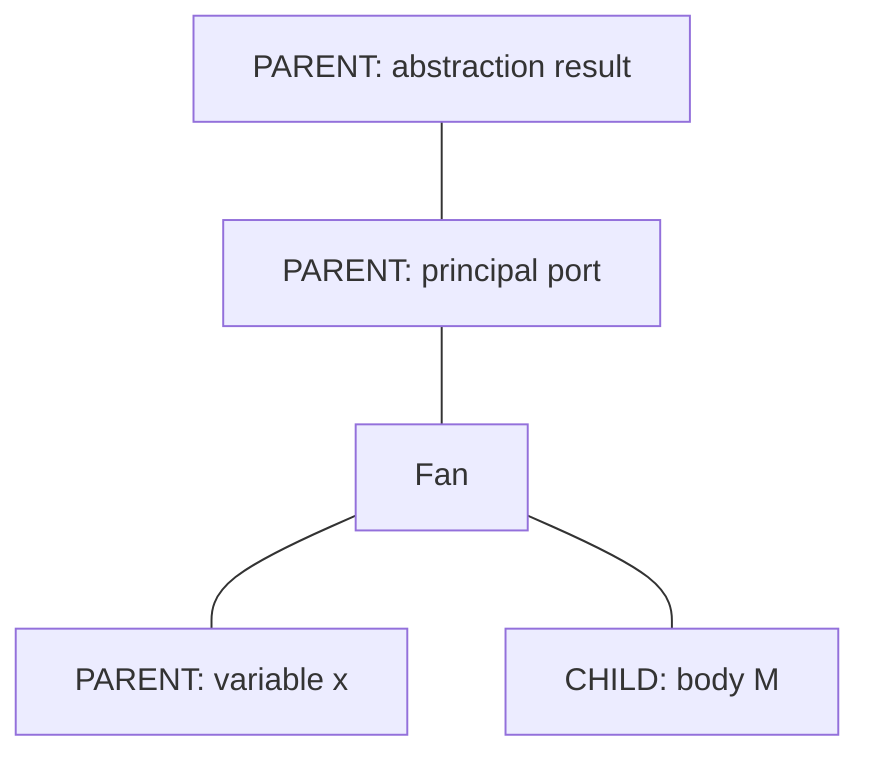
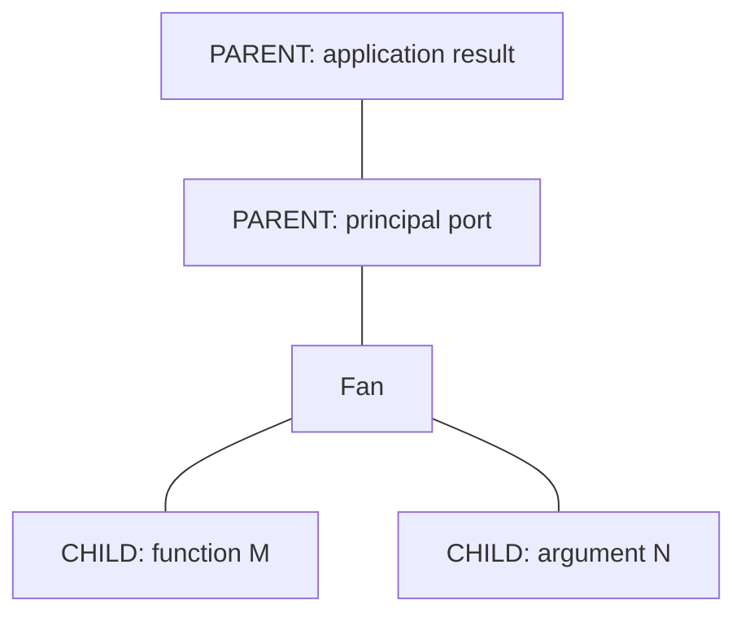
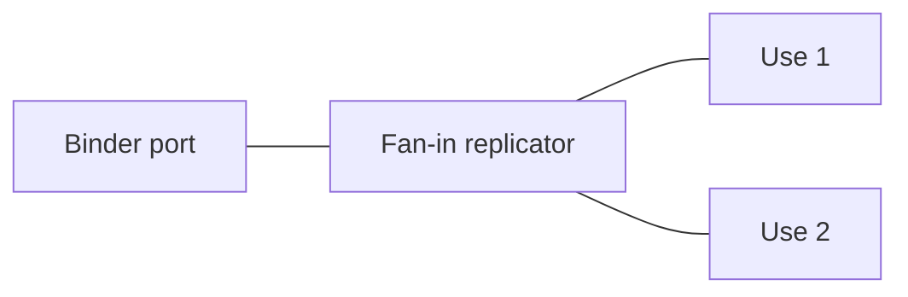
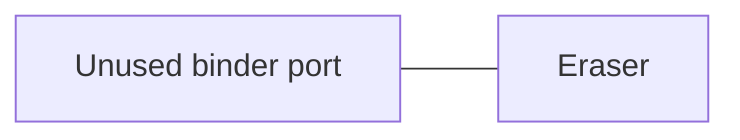

# Next Steps: Encoding Lambda Terms as Δ-Nets

This guide uses **encoding** for the operation that constructs a Δ-net graph from
lambda syntax.

## 1. Keep the four operations separate

```text
lambda source
    │
    ▼
  parse
    │
    ▼
lambda term
    │
    │  encode
    ▼
 Δ-net graph
    │
    │  interaction reduction
    ▼
normalized Δ-net graph
    │
    │  readback / decode
    ▼
result lambda term
```

- **Interpretation**: the semantic meaning of a lambda term.
- **Encoding**: construction of agents, ports, wires, replicators, erasers, and
  interface ports from syntax.
- **Reduction**: interaction between agents.
- **Readback/decode**: reconstruction of lambda syntax from the graph.

Do not use interpretation for the graph-construction function. The concrete
operation is encoding.

## 2. First milestone: make every rewrite trustworthy

Before encoding arbitrary terms, validate every existing interaction before and
after it runs:

```text
validate graph
      │
      ▼
perform one interaction
      │
      ▼
validate graph again
```

The validator must check:

- every live port has exactly one owner;
- every live port has exactly one wire;
- every wire has two distinct endpoints;
- every wire joins `PARENT` to `CHILD`;
- every active pair is principal–principal;
- every replicator auxiliary has polarity opposite its principal;
- auxiliary order and metadata order agree;
- no deleted port remains referenced;
- no auxiliary slice has two owners.

### Fan–replicator interaction

The concrete port operations are:

```text
fan.left  ──reused as──>  left_copy.principal
fan.right ──reused as──>  right_copy.principal

old_auxiliary[i] ──cloned twice──> left_auxiliary[i]
                             └──> right_auxiliary[i]

old_auxiliary[i] ──reused as──> new_fan.principal
new_left  ───────────────────── left_auxiliary[i]
new_right ───────────────────── right_auxiliary[i]
```

The rules are:

```text
reused port:
    keep its polarity and change only its structural owner/slot as required

cloned port:
    copy identity-independent metadata, receive a new identity/owner, and
    take the polarity required by its output replicator's reused principal

new port:
    receive the polarity opposite to the port at the other end of its wire
```

For this rewrite, the fan's branches have opposite polarity and become the
two output principals. The copies therefore have opposite orientations:

```text
left_auxiliary[i].polarity
    == opposite(left_copy.principal.polarity)   // fan-out auxiliaries

right_auxiliary[i].polarity
    == opposite(right_copy.principal.polarity)  // fan-in auxiliaries
```

Do not blindly copy source polarity in this rewrite. One copied family must
flip because fan–replicator commutation always produces one fan-in and one
fan-out.

## 3. Centralize graph mutation

Reduce direct array manipulation in rewrite rules. Use a narrow mutation API:

```text
new_fan()
new_eraser()
new_replicator(level, ordered_deltas, status, orientation)
new_interface_port(kind, name)
clone_port(source, owner)
connect(port_a, port_b)
disconnect(wire)
splice(port_a, port_b)
other_endpoint(wire, port)
destroy_node(node)
```

Each operation should update ownership, slot, polarity, wire IDs, and
back-references together.

## 4. Preserve interface ports as stable boundaries

An `InterfacePort` is not an active agent and never reduces by itself:

```text
InterfacePort
      │  stable boundary port
      │
      ▼
 internal graph
```

The internal endpoint can change after reduction:

```text
before:  InterfacePort ─── fan

after:   InterfacePort ─── new internal structure
```

The interface port itself keeps:

```text
kind
name
port identity
port polarity
```

Use these conventions:

```text
ROOT          → PARENT
FREE_VARIABLE → CHILD
```

## 5. Implement the lambda term representation

Use a small De Bruijn representation:

```text
Term :=
    BoundVar(index)
  | FreeVar(name)
  | Abstraction(body)
  | Application(function, argument)
```

De Bruijn indices avoid relying on printable variable names during encoding:

```text
λx.x       → Abstraction(BoundVar(0))
λx.λy.x    → Abstraction(Abstraction(BoundVar(1)))
```

Keep a simple normal-order reducer for reference results. It is the oracle for
the graph machine, not part of the graph implementation.

## 6. Encode abstractions

An abstraction has one result and two semantic branches:



Encoding steps:

```text
1. Allocate a fan.
2. Connect its principal to the destination/result port.
3. Create the binder-side variable port.
4. Encode the body below the child/body port.
5. Track the binder while recursively encoding the body.
```

The fan is not intrinsically labelled “lambda.” Its port roles and rooted
traversal determine the abstraction reading.

## 7. Encode applications

An application has one result and two child branches:



Encoding steps:

```text
1. Allocate a fan.
2. Connect its result/principal path to the destination port.
3. Encode the function under one child port.
4. Encode the argument under the other child port.
```

The application fan has two `CHILD` branches. The arrows in the diagram are
wire layout only; polarity labels classify endpoints and do not describe runtime
flow.

## 8. Encode variables

### Bound variable

For a bound occurrence, find its binder in the encoding environment:

```text
λx.x

binder x ───────── body occurrence x
```

If the variable is used once, a direct path is sufficient. If it is used more
than once, introduce a replicator:



### Free variable

For an unbound name, create or reuse a named `InterfacePort`:

```text
λx.y

root ─── abstraction ─── InterfacePort(name = "y")
```

The name must survive encoding, reduction, and readback.

## 9. Encode erasure and sharing

For an unused binder:

```text
λx.M       where x does not occur in M
```

connect the unused binder port to an eraser rather than allocating a useless
sharing structure:



Use a replicator when one bound value must serve multiple occurrences or when
level shifts require sharing metadata.

## 10. Implement readback before a full evaluator

Readback should work on hand-built graphs first:

```text
root
  → abstraction
  → application
  → bound variable
  → free-variable InterfacePort
  → replicator branch
  → erased branch
```

The rooted traversal uses polarity and port roles:

```text
enter principal/result path as PARENT
    → abstraction reading

enter application result path as PARENT
    → application reading

reach named InterfacePort
    → FreeVar(name)
```

Do not infer traversal order from wire-array allocation order.

## 11. Differential verification

For each sample:

```text
source
  → parse
  → De Bruijn term
  → reference normal-order reducer

source
  → encode
  → Δ-net reduction
  → readback

compare both results up to alpha-equivalence
```

Start with:

```text
(λx.x) y                  → y
(λx.y) Ω                  → y
(λx.x x) (λy.y)          → λy.y
λx.x                      → λx.x
λx.λy.x                   → λx.λy.x
λx.x x                    → λx.x x
```

The next implementation milestone is therefore:

```text
validated rewrites
    → rooted traversal
    → small De Bruijn term model
    → abstraction/application encoding
    → variable, eraser, and sharing encoding
    → readback
    → differential tests
```
